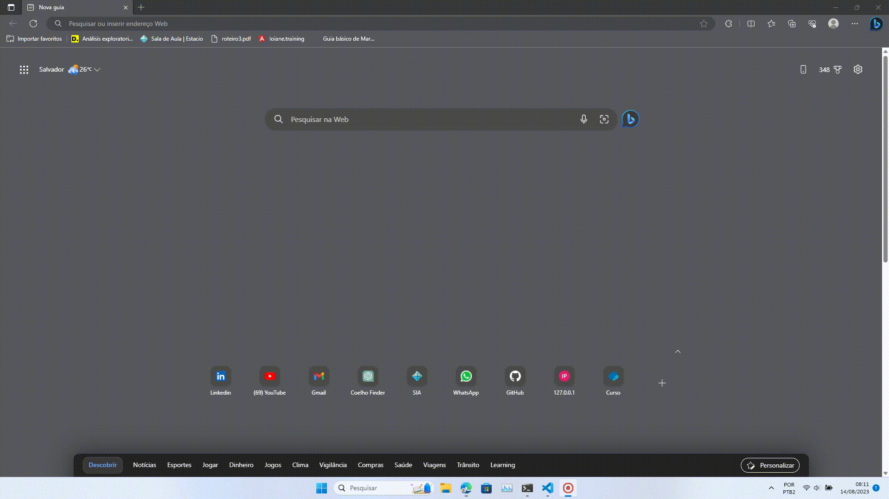
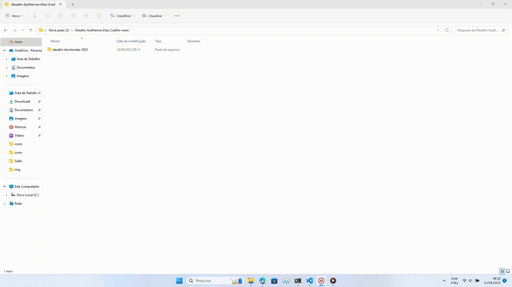
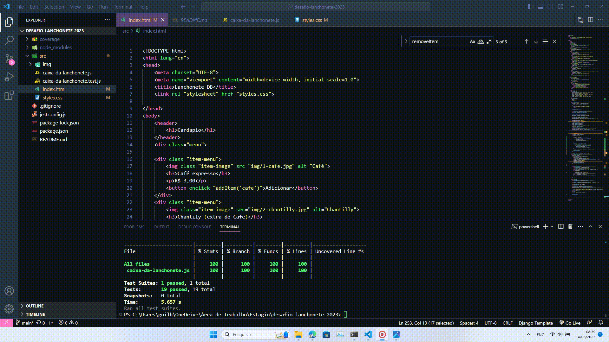

# Desafio Lanchonete

Este é um projeto desenvolvido como parte de um desafio para criar um sistema de caixa para uma lanchonete.

## Funcionalidades

- Adicionar itens ao carrinho de compra.
- Remover itens do carrinho de compra.
- Calcular o total da compra com diferentes formas de pagamento.
- Aplicar tributos de acordo com a forma de pagamento.
- Testes automatizados para a lógica do caixa da lanchonete.

## Tecnologias Utilizadas

- JavaScript (ES6+)
- Jest (para testes automatizados)

## Como Usar

1. Clone o repositório: `https://github.com/Kouta-22/Desafio-Guilherme-Dias-Coelho`

2. Navegue até a pasta do projeto: `cd desafio-lanchonete`

3. Execute os testes: `npm test`

4. Execute o projeto: Abra o arquivo `index.html` em um navegador web.

## Estrutura do Projeto

- `/src`: Contém os arquivos JavaScript do projeto.
- `/test`: Contém os arquivos de teste automatizado.

Feito por [Guilherme Dias Coelho](https://github.com/Kouta-22/Desafio-Guilherme-Dias-Coelho)
